# Architecture de MinuteGuard

## Choix d'architecture

MinuteGuard est une application pilotée par prompt, pas un agent autonome. Son
objectif est unique, son chemin d'exécution est déterministe et le modèle ne
choisit ni outils ni sous-objectifs. Cette simplicité réduit les coûts, les
surfaces d'attaque et la difficulté d'audit.

```mermaid
flowchart LR
    A[Compte rendu .txt] --> B[Découpage par lignes]
    B --> C[Prompt versionné]
    C --> D[LLM / Responses API]
    D --> E[Validation Pydantic]
    E --> F[Contrôle des citations]
    F --> G[Fusion et déduplication]
    G --> H[JSON + rapport Markdown]
    H --> I[Revue humaine]
```

Le fournisseur `fixture` remplace D pendant la démonstration hors ligne. Tout
le reste du pipeline est identique : il s'agit donc d'un test utile de
l'orchestration, mais pas d'une mesure de qualité du modèle.

## Responsabilités

| Composant | Responsabilité | Échec explicite |
|---|---|---|
| `chunking.py` | limiter la taille et conserver les lignes | configuration invalide |
| `prompts.py` | charger une variante et délimiter la source | variante inconnue |
| `providers.py` | appeler le fournisseur et gérer les erreurs transitoires | nombre maximal d'essais |
| `models.py` | imposer types, champs et dates | erreur de validation |
| `grounding.py` | vérifier que chaque citation existe aux lignes annoncées | rejet de l'élément |
| `pipeline.py` | orchestrer, fusionner, dédupliquer | entrée vide ou réponse invalide |
| `evaluation.py` | calculer des métriques reproductibles | cas absent ou schéma invalide |

## Flux de confiance

1. La source est non fiable et reste dans le message utilisateur délimité.
2. Les règles stables sont dans les instructions système.
3. Le modèle doit respecter un JSON Schema strict.
4. Pydantic revalide localement la réponse.
5. Un contrôle déterministe supprime toute décision, action ou risque dont la
   citation n'est pas retrouvée dans la source.
6. Le rapport indique les rejets et rappelle la nécessité d'une revue humaine.

Le schéma empêche les champs inattendus, mais ne garantit pas la vérité. Le
contrôle des citations améliore la traçabilité, mais ne prouve pas que
l'interprétation de la citation est correcte.

## Longs documents

Le découpage utilise un budget de caractères conservateur, car les tokens
dépendent du tokenizer du modèle. Deux lignes se chevauchent par défaut entre
segments. Après extraction, les éléments sont dédupliqués par une clé lexicale
normalisée, puis renumérotés. Compromis : une relation entre deux passages très
éloignés peut être perdue ; un futur développement pourrait utiliser un second
passage de consolidation.

## Reproductibilité

- Python minimal : 3.11 ;
- dépendances bornées dans `pyproject.toml` ;
- modèle configurable par `--model` ou `MINUTEGUARD_MODEL` ;
- température fixée à 0 pour limiter, sans supprimer, la variabilité ;
- hash SHA-256 de la source dans chaque enveloppe ;
- fixtures, jeu d'évaluation et prompts versionnés ;
- aucune clé ni sortie d'exécution locale versionnée.

